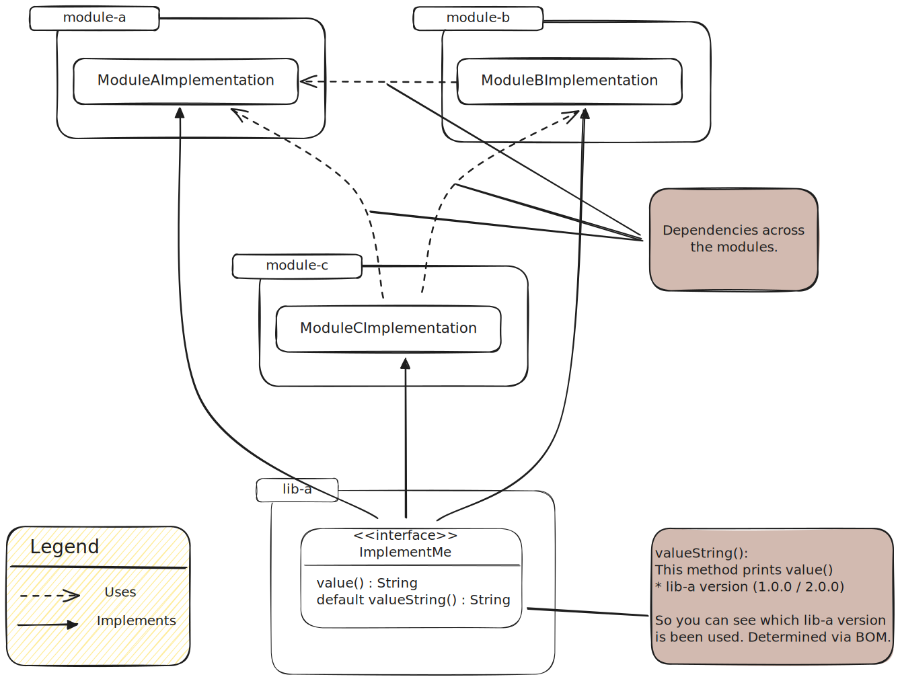
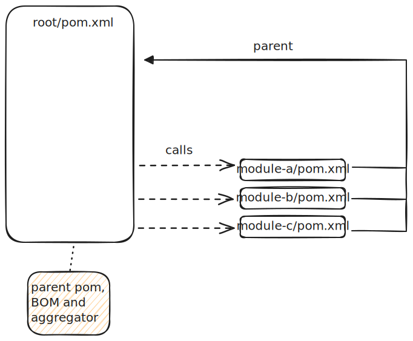
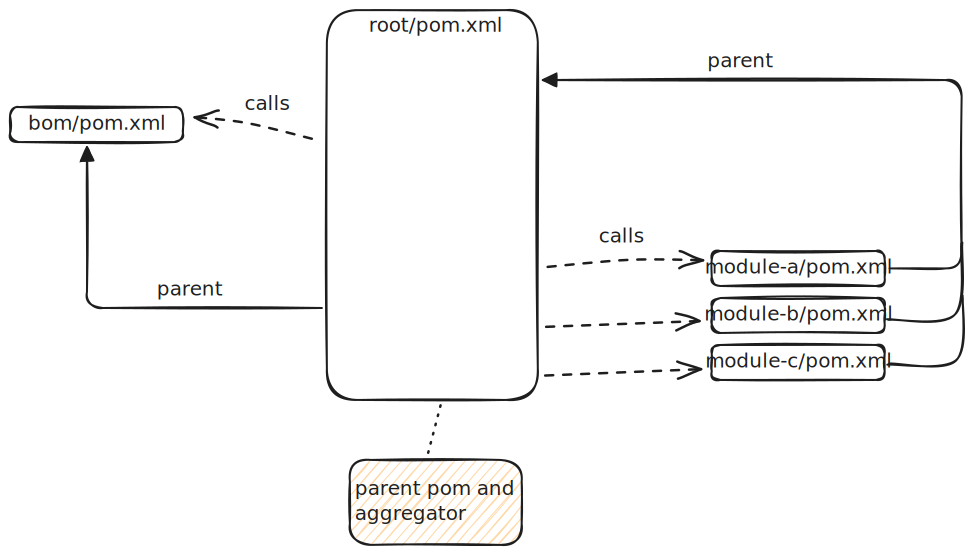
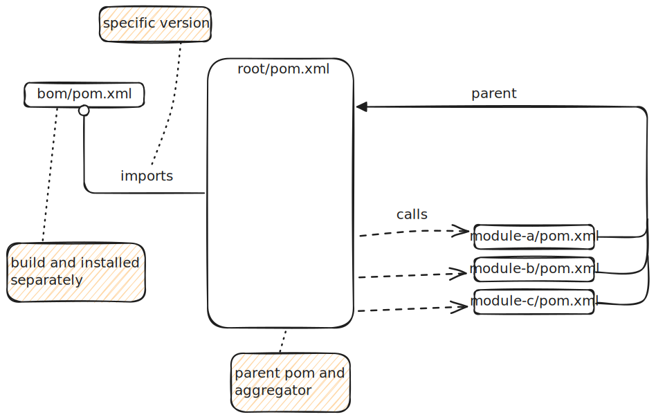
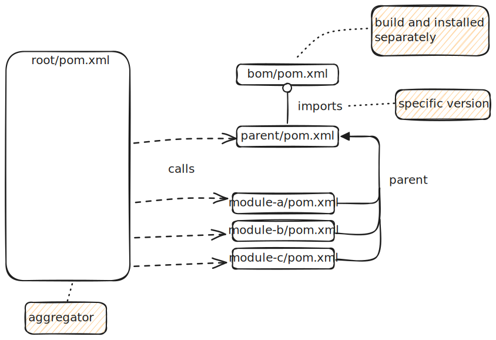

# Maven's Bill Of Material (BOM)

This project should show scenarios on how to use *Maven's bill of materials*, *Parent POMs* and *aggregator projects*.

# Definitions

## Parent POM

A *parent pom* is a convenient way for using some project settings for multiple projects or *modules*.
There is a one *Super POM* which all projects inherit from.
And it is packaged with your *Maven* installation.

### Creating a *parent pom*

A *parent pom* is just a normal `pom.xml` but with `<packaging>` set to `pom`.

```xml
<project xmlns="http://maven.apache.org/POM/4.0.0">
    <modelVersion>4.0.0</modelVersion>

    <groupId>parent-groupId</groupId>
    <artifactId>parent-artiffactId</artifactId>
    <version>parent-version</version>
    <packaging>pom</packaging>
    
    <!-- Your setting you want to be inherited -->
</project>
```

A *parent pom* can also have a *parent*!

For more details see [Maven Documentation](https://maven.apache.org/guides/introduction/introduction-to-the-pom.html#Project_Inheritance).

### Setting a *parent pom*

Setting a *parent pom* is done via adding the `<parent>` tag.

```xml
<project xmlns="http://maven.apache.org/POM/4.0.0">
    <modelVersion>4.0.0</modelVersion>

    <groupId>projects-groupId</groupId>
    <artifactId>projects-artiffactId</artifactId>
    <version>projects-version</version>

    <parent>
        <groupId>parents-groupId</groupId>
        <artifactId>parents-artifactId</artifactId>
        <version>parents-version</version>
        <relativePath>../pom.xml</relativePath>
    </parent>
</project>
```
You can dismiss the `groupId`, `artifactId`, `version` if these should match the `parent pom's` equivalents.

Also, it is not necessary to provide *parent pom's* `<relativePath>`, if it the parent should be managed outside your project structure.

### Check your *pom.xml*

With the following command you can see the *project's pom* after applying all inheritances.

```shell
mvn help:effective-pom
```

## Project Aggregation

A similar concept is *project aggregation*.
With *project aggregation* you can define which project/module should be built.
The `<module>` tag uses relative path to the directory in which the projects `pom.xml` lies.

```xml
<project xmlns="http://maven.apache.org/POM/4.0.0">
    <modelVersion>4.0.0</modelVersion>

    <groupId>aggregator-groupId</groupId>
    <artifactId>aggregator-artifactId</artifactId>
    <version>aggregator-version</version>
    <packaging>pom</packaging>


    <modules>
        <module>module-01</module>
        <module>module-02</module>
        <module>...</module>
    </modules>
</project>
```

For more details see [Maven Documentation](https://maven.apache.org/guides/introduction/introduction-to-the-pom.html#Project_Aggregation).

If you do not want the *aggregator* project to be installed in your repository.
You can use the `org.apache.maven.plugins:maven-install-plugin` in the `build` tag.

```xml
<build>
    <plugins>
        <plugin>
            <groupId>org.apache.maven.plugins</groupId>
            <artifactId>maven-install-plugin</artifactId>
            <configuration>
                <skip>true</skip>
            </configuration>
        </plugin>
    </plugins>
</build>
```

## Bill Of Material (BOM)

A *Bill Of Material* or *BOM* for short is used for dependency management (see: [Maven Documentation](https://maven.apache.org/guides/introduction/introduction-to-dependency-mechanism.html#Bill_of_Materials_.28BOM.29_POMs)).
It's main purpose is to keep the *dependencies* and their *versions* in sync across projects.

You define your *dependencies* in the *BOM pom* and import this project into the actual project.
There you just need to declare your *dependency* but without the *version*. 
The *version*, and some settings, of the *dependency* comes from the *BOM pom*.

### Example
Here is an example of the *BOM pom* and a project which uses it:

*BOM* project:
```xml
<project xmlns="http://maven.apache.org/POM/4.0.0"
	xmlns:xsi="http://www.w3.org/2001/XMLSchema-instance"
	xsi:schemaLocation="http://maven.apache.org/POM/4.0.0 http://maven.apache.org/xsd/maven-4.0.0.xsd"
	>  
    <modelVersion>4.0.0</modelVersion> 
	
	<groupId>bom-groupId</groupId>  
    <artifactId>bom-artifactId</artifactId>  
    <version>1.0.0</version>
    <packaging>pom</packaging>
      
    <dependencyManagement>
        <dependencies>
            <dependency>
                <groupId>lib-a-groupId</groupId>
                <artifactId>lib-a</artifactId>
                <version>1.0.0</version>
            </dependency>
            <dependency>
                <groupId>lib-b-groupId</groupId>
                <artifactId>lib-b</artifactId>
                <version>2.0.0</version>
            </dependency>
            <dependency>
                <groupId>lib-x-groupId</groupId>
                <artifactId>lib-x-bom</artifactId>
                <version>1.5.3</version>
                <type>pom</type>
                <scope>import</scope>
            </dependency>
        </dependencies>
    </dependencyManagement>
</project>
```

Project which uses the *BOM*:
```xml
<project xmlns="http://maven.apache.org/POM/4.0.0"
	xmlns:xsi="http://www.w3.org/2001/XMLSchema-instance"
	xsi:schemaLocation="http://maven.apache.org/POM/4.0.0 http://maven.apache.org/xsd/maven-4.0.0.xsd"
	>  
    <modelVersion>4.0.0</modelVersion> 
	
	<groupId>project-groupId</groupId>  
    <artifactId>project-artifactId</artifactId>  
    <version>1.3.0-SNAPSHOT</version>
    
    <dependencies>
        <dependency>
            <groupId>lib-a-groupId</groupId>
            <artifactId>lib-a</artifactId>
        </dependency>
        <dependency>
            <groupId>lib-z-groupId</groupId>
            <artifactId>lib-z-from-bom-x</artifactId>
        </dependency>
        <dependency>
            <groupId>lib-z-groupId</groupId>
            <artifactId>lib-y-from-bom-x</artifactId>
        </dependency>
    </dependencies>
      
    <dependencyManagement>
        <dependencies>
            <dependency>
                <groupId>bom-groupId</groupId>
                <artifactId>bom-artifactId</artifactId>
                <version>1.0.0</version>
                <type>pom</type>
                <scope>import</scope>
            </dependency>
        </dependencies>
    </dependencyManagement>
</project>
```

# Scenarios

This project is covering following scenarios. 
The *root* project serves as *aggregator* in all scenarios.
Even you can build all *scenarios* from the root directory.
It is meant, that all scenarios should be a treatable as standalone projects!

## Common Ground

I tried to create a very simple example of a multimodule project.
It consists of three *modules*, `module-a`, `module-b` and `module-c`.
These modules have dependencies among another, see /TODO/.
All these *modules* uses a *library* `lib-a`.
This library **must** be `build` and `installed` beforehand!
There are two versions of this `lib-a` version `1.0.0` and `2.0.0`, which can be set via command line e.g. `-Dlib-a.version=1.0.0`.
All scenarios ship with their own `lib-a`, changed `groupId`.
So the scenarios do not interfere with each others.

Architecture of the common projects:


## Building

Since in all *scenarios* we use `lib-a` in different versions.
We first have to install them.
```shell
mvn clean install -Plibraries
```

After this you can `package` with the `default profile`, named `project`.
```shell
mvn clean package -Drevision=1.0.0-SNAPSHOT -Dlib-a.version=1.0.0
```

For convenience in all *scenarios* there is a [Maven Config File](https://maven.apache.org/configure.html) `.mvn/maven.config`.
In this file you can set your project `revision` and/or `lib-a.version`.
So you only need to call.
```shell
mvn clean package
```

In the *scenarios* with independent *BOM*/*parent* you can also install the *BOM*/*parent* first, with the profile `independants`.
After this use the profile *project-wo-independants*.

### Usage Of Maven Ci Friendly Versions

[Maven Ci Friendly Versions](https://maven.apache.org/guides/mini/guide-maven-ci-friendly.html) is a way to postpone the version of your current project.
So you don't have to add hardcoded versions through your *(multi-)projects*.
With the [Flatten Maven Plugin](https://www.mojohaus.org/flatten-maven-plugin/) you get the *poms* installed, with real versions.

**Note:**
I use the `flattenMode=default` and not `flattenMode=resolveCiFriendliesOnly`.
Because I want to have stable versions in my installed *poms* / *BOMs*.

## Scenario 01: Root Is Parent And BOM 

This scenario is best fit for small multimodule projects.
You most likely will use this scenario.



## Scenario 02: The BOM is Parent Of Root

This scenario is the one propagated in [Maven Documentation](https://maven.apache.org/guides/introduction/introduction-to-dependency-mechanism.html#Bill_of_Materials_.28BOM.29_POMs).
But I decided for convenience to use the *root* as aggregator and don't aggregate via the *bom*. 
You have a *BOM project* which is also the parent of your *root project*.



## Scenario 03: Independent BOM

This scenario is showcases if the *BOM* is provided by your company.
Or if you want to be the source of the *BOM*, and this *BOM* should also be used in other projects not in this repository.



## Scenario 04: Independent Parent And BOM

This scenario is the most flexible, but mostly not best understood.
Here you have an independent *BOM* like in [Scenario 03](#scenario-03-independent-bom), but also an independent *parent* project.
Now for this example it is an overkill, but imagine you have a multimodule project with e.g. *frontend* and *backend*.
These different parts / project have different build setups and or different dependencies.
So you can create two *parent projects* with the specifics of the parts and use them accordingly in your *sub-projects* as *parent-pom* (e.g. *frontend-parent*, *backend-parent*).
And please keep in mind *aggregator projects* =/= *parent projects*!



# License

This repository is published under the [MIT License](LICENSE.txt).
